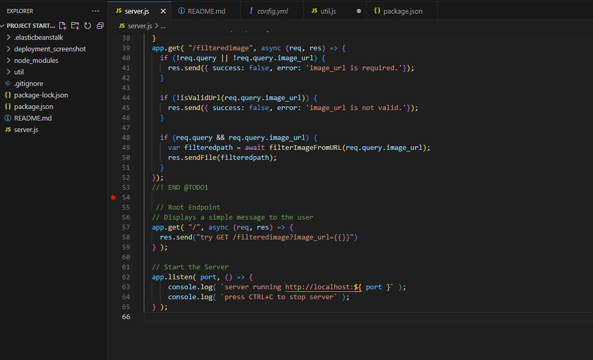
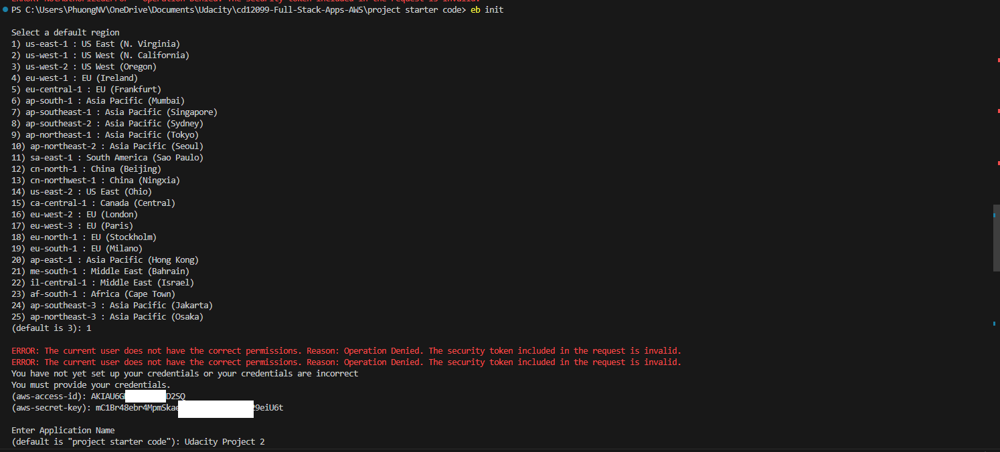
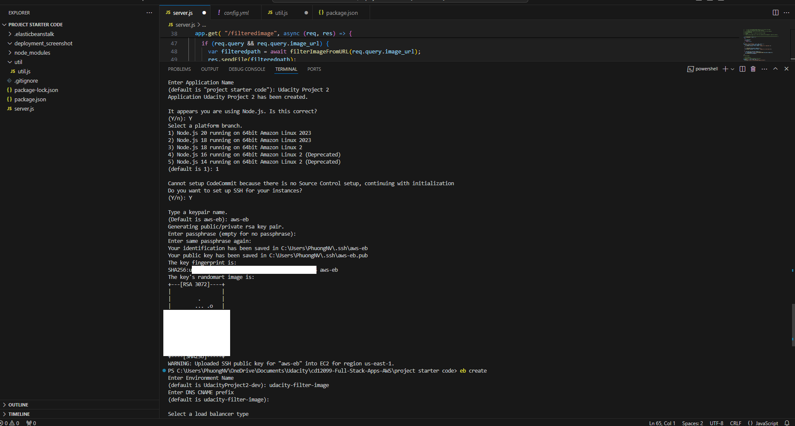
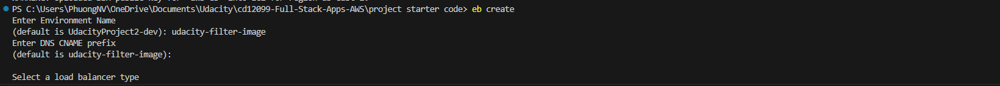
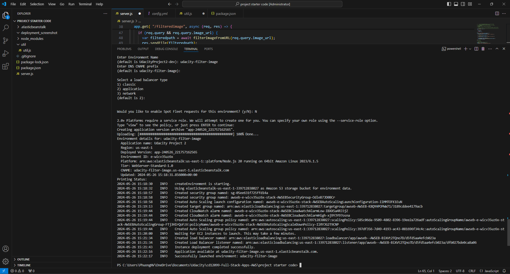
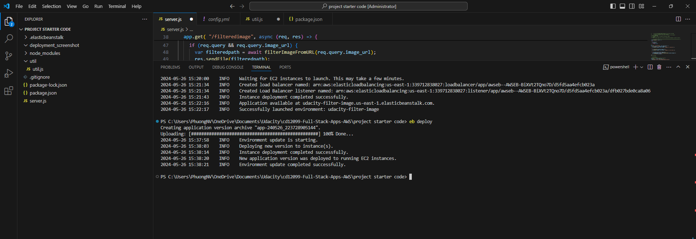
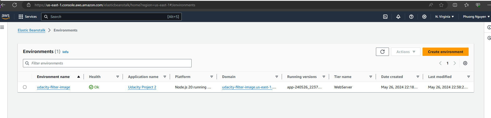
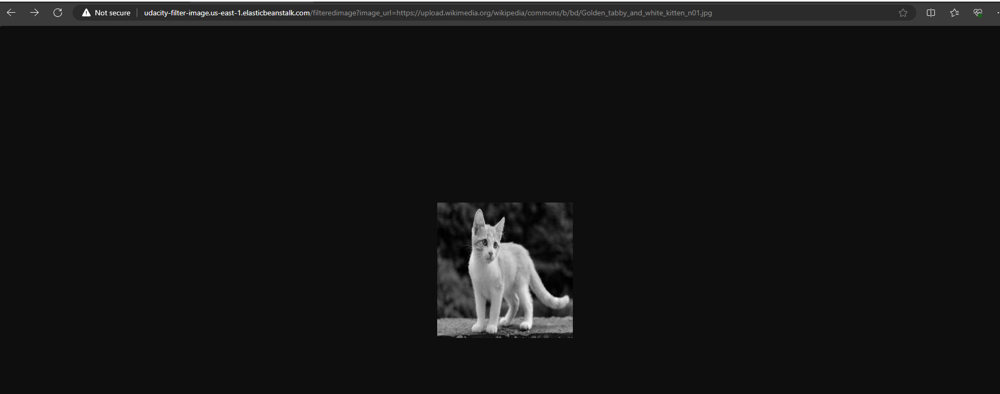

# Project: Image Processing Microservice on AWS

## I. NodeJS Project:

### Route server:

- 

## II. Elastic Beanstalk Deployment:

### 1. Init Elastic Beanstalk:

Init Elastic Beanstalk by using: 
```bash
eb init
```





### 2. Create Elastic Beanstalk:

Create Elastic Beanstalk by using: 
```bash
eb create
```





### 3. Deploy website to Elastic Beanstalk:

Deploy website to Elastic Beanstalk by using: 
```bash
eb deploy
```







## III. References:
[udacity-filter-image](http://udacity-filter-image.us-east-1.elasticbeanstalk.com/filteredimage?image_url=https://upload.wikimedia.org/wikipedia/commons/b/bd/Golden_tabby_and_white_kitten_n01.jpg)